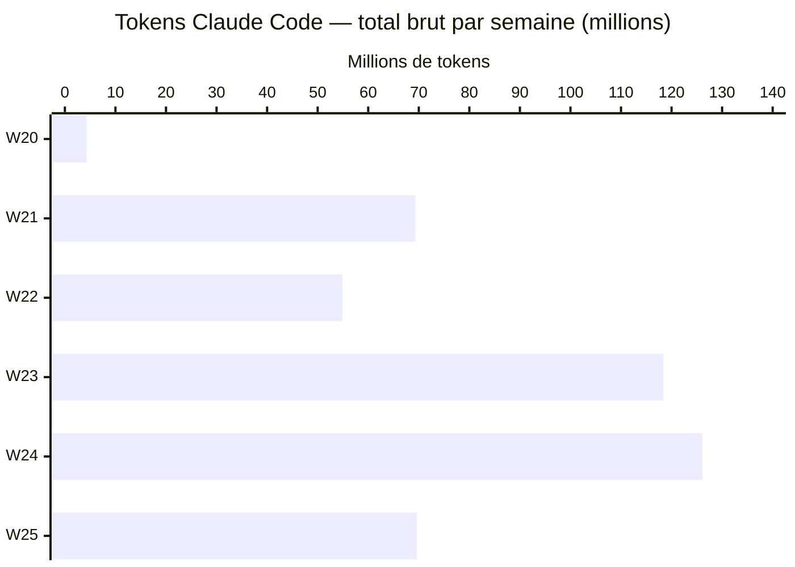
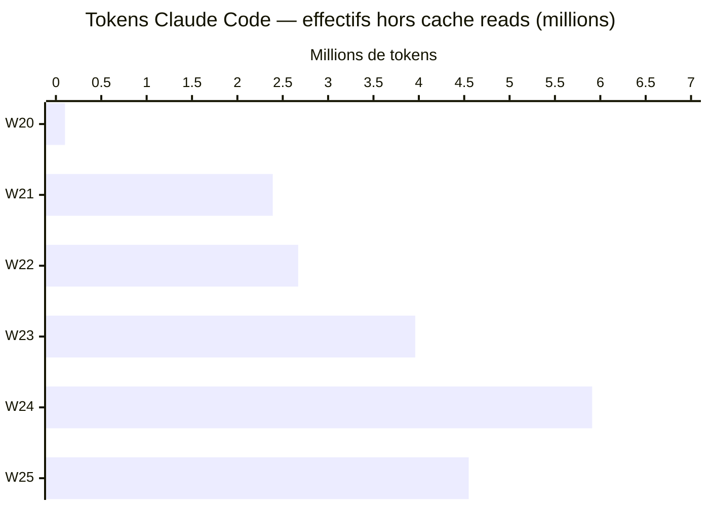

# AirPair — Bilan Software Carbon Intensity

**Phase 1 · 19 juin 2026 · SCI v1.1 / ISO IEC 21031:2024**

---

## Claude Code — consommation par semaine (API Anthropic)

Les tokens ci-dessous proviennent des logs locaux Claude Code (`~/.claude/`), mesurés via `npx ccusage@latest`. Ils représentent les appels à l'**API Anthropic** — centre de coût « développement ». Le coût AWS (EC2 t4g.nano, opérationnel) est traité séparément.

### Histogramme A — tokens bruts par semaine (millions)

> 96 % des tokens bruts sont des **lectures de prompt cache** — compute GPU minimal.

### Histogramme B — tokens effectifs hors cache reads (millions)

> Ces tokens représentent le **compute GPU réel** : input frais + output généré + création de cache. Le reste (96 %) est relu depuis la mémoire KV du prompt cache Anthropic à ~10× moins d'énergie.

### Tableau détaillé

Mix réseau applicable à Claude Code : **US ~400 gCO₂e/kWh** (serveurs Anthropic, infrastructure AWS us-east).

| Semaine | Phase | Tokens bruts | dont cache reads | Tokens effectifs | Coût éq. API |
|---------|-------|-------------|-----------------|-----------------|-------------|
| W20 (12 mai) | exploration | 4,3 M | 4,2 M (97 %) | 0,10 M | $2 |
| W21 (18–22 mai) | phase 0 | 69,3 M | 66,9 M (97 %) | 2,39 M | $39 |
| W22 (25–31 mai) | phase 0 | 54,9 M | 52,2 M (95 %) | 2,67 M | $35 |
| W23 (1–7 juin) | ⚠️ transition | 118,4 M | 114,5 M (97 %) | 3,96 M | $63 |
| W24 (8–12 juin) | phase 1 | 126,1 M | 120,2 M (95 %) | 5,91 M | $77 |
| W25 (15–19 juin) | phase 1 | 69,6 M | 65,1 M (94 %) | 4,55 M | $55 |
| **Total** | | **442 M** | **423 M (96 %)** | **19,58 M** | **$270** |

> **W23 ⚠️** — semaine de transition : conception documentée le 7 juin, mais commits d'implémentation présents dès le 1er. Ratio retenu : 50 % conception / 50 % phase 1.
>
> **Les $270** sont le coût API Anthropic équivalent à l'abonnement Claude Code — non facturés à l'unité dans le cadre de l'abonnement.

---

## Centres de coût

| Centre de coût | Nature | Montant phase 1 | Mesure |
|----------------|--------|----------------|--------|
| API Anthropic (Claude Code) | Développement | $270 éq. API | Mesuré — `sci/ai-usage/2026-W*.json` |
| AWS EC2 t4g.nano | Opérationnel | ~$3–4/mois | Estimé — `sci/factors.yaml` |
| GitHub Actions CI | Développement | < $1 | Estimé |

---

## Sessions manuelles (worklog)

Activités hors Claude Code : sessions claude.ai web, temps humain, playtests terrain.

| Date | Phase | Activité | Outil | Mix réseau | Durée | CO₂e min | CO₂e max |
|------|-------|----------|-------|-----------|-------|----------|----------|
| 2026-06-07 | conception | Design complet, docs (PROJECT.md, decisions.md, sci.md…) | claude.ai | US ~400 g/kWh | — | 5 g | 75 g |
| 2026-06-07 | conception | Énergie poste de travail (sessions claude.ai) | laptop | FR 52 g/kWh | — | 2 g | 30 g |
| 2026-06-11 | phase 1 | Playtests terrain W24 — 2 sessions | smartphone | FR 52 g/kWh | 4 h | 1 g | 2 g |
| 2026-06-11 | phase 1 | Sessions claude.ai — challenger idées game design | claude.ai | US ~400 g/kWh | 3,5 h | 2 g | 60 g |
| 2026-06-11 | phase 1 | Synthèse playtests — rédaction notes et décisions | laptop | FR 52 g/kWh | 2 h | 2 g | 6 g |
| 2026-06-17 | phase 1 | Playtest terrain W25 — 1 session | smartphone | FR 52 g/kWh | 2 h | 0 g | 1 g |

---

## CO₂e — empreinte estimée

**Valeurs cumulées sur l'ensemble de la période W20–W25** (toutes sessions confondues, pas par semaine ni par jour).

| Composant | Mix réseau | Hypothèse | Fourchette basse | Fourchette haute |
|-----------|-----------|-----------|-----------------|-----------------|
| Claude Code (API Anthropic) | US ~400 g/kWh | Cache reads à 10 % du coût d'un token frais | 20 g | 210 g |
| claude.ai web (sessions manuelles) | US ~400 g/kWh | Estimation par nb d'échanges | 7 g | 135 g |
| Laptop (sessions manuelles) | FR 52 g/kWh | Puissance × durée × mix FR | 4 g | 36 g |
| Smartphones (playtests) | FR 52 g/kWh | Puissance active × durée × mix FR | 1 g | 3 g |
| **Total — fourchette raisonnable** | | | **32 g** | **384 g** |
| Claude Code — pire cas | US ~400 g/kWh | Cache reads au coût plein (×10 vs raisonnable) | — | ~1 350 g |
| **Total — pire cas** | | | — | **~1 500 g** |

**Pourquoi deux scénarios Claude Code ?**
Les 423 M tokens de cache reads ont un coût énergétique inconnu — Anthropic ne publie aucun facteur officiel. L'hypothèse raisonnable suppose qu'un token relu depuis le cache coûte ~10 % d'un token calculé (cohérent avec la littérature sur les KV caches). L'hypothèse pire cas suppose le coût plein, soit ×10 supérieur — d'où 210 g × ~6,4 ≈ 1 350 g. Ce n'est pas ×12 : le facteur 12 correspond au ratio de la fourchette totale raisonnable (384/32).

> Calcul officiel prévu en fin de phase 1 avec `sci/factors.yaml › ai_inference`.

### Équivalents CO₂e — fourchette raisonnable cumulée (32–384 g)

| | Fourchette raisonnable | Pire cas (~1 500 g) |
|-|----------------------|---------------------|
| 🚗 Voiture essence | 160 m – 1,9 km | 7,5 km |
| ☕ Café en dosette | 1 – 10 capsules | 38 capsules |
| 🥩 Viande rouge (bœuf) | 1 – 14 g de bœuf | 56 g de bœuf |
| 📺 Vidéo YouTube (HD, WiFi) | 50 min – 11 h | ~42 h |

*Sources : ADEME — 200 gCO₂e/km (voiture moyenne essence), 40 gCO₂e/capsule (café), 27 kgCO₂e/kg (bœuf France). IEA 2020 — 36 gCO₂e/h (streaming HD WiFi, mix mondial).*

---

## Méthode et sources

- **Méthodologie SCI** : [`docs/sci.md`](sci.md)
- **Facteurs d'émission** (gelés phase 1) : [`sci/factors.yaml`](../sci/factors.yaml) v1.0.0 — 2026-06-11
- **Données Claude Code** : `sci/ai-usage/2026-W*.json` — export `npx ccusage@latest daily --json`
- **Sessions manuelles** : `sci/worklog.csv`
